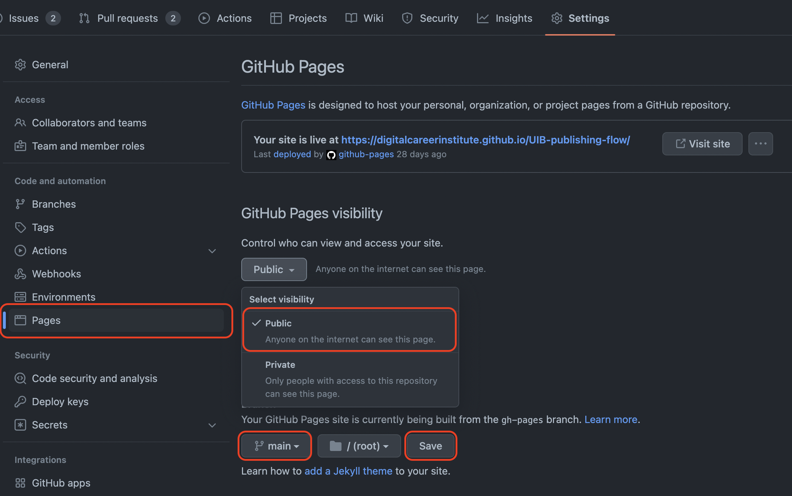

# Publishing Workflow

Let's make our work public to share it with the world. Use this power wisely and **within legal laws & regulations** (no hate, no bullying, misinformation etc.).

We will use Github's service **Github pages** to publish content of repositories to a publicly accessible URL in the shape of https://accountname.github.io/repositoryname/. 

## Prerequisites
Make sure that you have admin access to this repository. This is needed in order for you to enable GitHub pages.
## Instructions

1. Enable GitHub Pages for this repository.
    * See the settings tab of your repository, on the left navigate to the sub menu **Pages**
    * Github will show the URL of your public page on top of the Source section. It will look like https://youraccount.github.io/repositoryname/
2. Create an `index.html` file as a starting point and fill it with some boilerplate code (e.g. a document title and a first level heading `<h1>Hello public world</h1>`)
3. Visit the public URL (like https://youraccount.github.io/repositoryname/) and check if everything works like it should.

[//]: # (autograding info start)
#  Results
> ⌛ Give it a minute. As long as you see the orange dot  on top, CodeBuddy is still processing. Refresh this page to see it's current status.
>
> This is what CodeBuddy found when running your code. It is to show you what you have achieved and to give you hints on how to complete the exercise.

### Page

|                 Status                  | Check                                                                                    |
| :-------------------------------------: | :--------------------------------------------------------------------------------------- |
|  | `index.html` file exists and contains `h1` element |

### Publishing

|                 Status                  | Check                                                                                    |
| :-------------------------------------: | :--------------------------------------------------------------------------------------- |
|  | This repository is published on GitHub pages |

[🔬 Results Details](../../actions)
[🐞 Tips on Debugging](https://github.com/DCI-EdTech/autograding-setup/wiki/How-to-work-with-CodeBuddy)
[📢 Report Problem](https://docs.google.com/forms/d/e/1FAIpQLSfS8wPh6bCMTLF2wmjiE5_UhPiOEnubEwwPLN_M8zTCjx5qbg/viewform?usp=pp_url&entry.652569746=UIB-publishing-flow)

[//]: # (autograding info end)